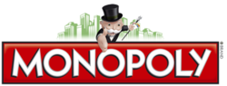

# Monopoly Analysis
*version Alpha 0.1*



The famous fast-trading board game Monopoly meets decision support analysis.

> It's the fast-dealing property trading game where players buy, sell, dream and scheme their way to riches

**WARNING** This program is still in Alpha. There will be a lot of hickups along the way. Sorry for the inconveninece.

**WARNING** This program **currently** have no user interface. User that cannot troubleshoot Python code should not try the program until beta.

##  Objective
This repository and project is created for **decision support** usage.<br>
Users can use this project in decisions-making purpose that could change the game aspects or leaders.

The analysis will be based on information given, statistics calculations and many risks factor that other player have create.

Users that use this program will able to:
- Understand the risks of making a move
- Estimates the property values and upgrades
- Show risks and rewards throughout the gameplay

##  How to install
Download this repository by cloning or click [here to download the .zip file](https://github.com/sagelga/monopoly-analysis/archive/master.zip).

If you have cloned (or download) this service, run this on your Terminal (or command prompt)
```
python3 main.py
```

> This program will requires Python programming language. Please download prior the launch of the program.

##  How to use
> For more details, please check out our [user manual](https://sagelga.github.io/monopoly-analysis/).

I recommended that you play on the real Monopoly board game, and use this service to provide more information about the game. We are not the game itself.

There is a few steps of the game that you need to follow. You will be asked for multiple inputs (eg. turns, decision made, dice rolls result) and there will be prompt in the command line (for current version)

Step 1: Type in **all** of the users.<br>
Step 2: Type in the orders that each user get (or skip if you liked to make us random)<br>
Step 3: Type in the rolls you get (or skip if you liked to make us random)<br>
Step 4: Choose to do any actions (Buy/Trade Property, Auction, Make/Redo Mortgage, Buy/Sell Assets or Finish Turn)<br>

and the process will repeat until we have the real Monopoly winner.

The interface will show the current game status. You

##  Documentation
The documentation on how to use/modify our modules, projects will be available shortly in GitHub Pages.

### Module distribution
This project is divided to 4 files (Python file), which is
[`main.py`]()
[`service.py`]()
[`actions.py`]()
[`transaction.py`]()
[`database.py`]()
[`configuration.py`]()

which
- main          : serves as program initiator + flow control
- service       : handle action made by user or asked for response from user
- action        : handle background action
- transaction   : prepare transaction to be made on database
- database      : create transaction directly to SQLite database
- configuration : user defined rules, which can **only** be retrieved.

#### Rules
All logical calculations are done in service and transaction.<br>
All interfaces is done in service<br>
All database change must be done in transaction first.<br>

##  Contribute
We welcome all of the developers into the development of this program. Please contact me for more information or to enroll.

----
## Other Stuff
### Configuration structure
Please check on the [documentation](https://sagelga.github.io/monopoly-analysis) page for more information.

### Boring things that you need to know
The project is fan-made and built in the purpose of **support** the players (user) into making the decisions along the gameplay.

This project can be used in non-commercial or/and non-profit purpose and requires the users to respect all the developers, copyright owner(s) and trademark owner(s). We are not response of trademark infringement or any legal actions against us.<br>
Make sure that you are **forking this repository** for further inspections.

If you liked to use this repository in a commercial or for-profit benefits, please contact me and respective game trademark owner.

If you liked to suggests on legal terms we have in this repository, please **directly** contact me via E-Mail, provided in my profile page.

[Monopoly](https://www.hasbro.com/en-us/brands/monopoly) is a trademark from Hasbro or its subsidiaries, licensors, licensees, suppliers and accounts.<br>
© 1935, 2017 Hasbro, Pawtucket, RI 02861-1059 USA. All Rights Reserved. TM & ® denote U.S. Trademarks.

Icons inside this project's README file is from [icons8.com](icons8.com).

Project is made possible with Python and Sphynx document generator.

Information about the Monopoly gaming rule is from multiple sources. Please check each "game package" to see more information.
